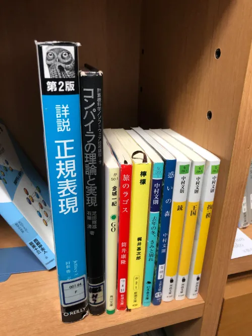

はじめての月報です。フォーマットはまだ探ってます。

## 今月の月報

- [1st](/weekly/2023/01/2023-01-08_1st.md)
- [2nd](/weekly/2023/01/2023-01-15_2nd.md)
- [3rd](/weekly/2023/01/2023-01-23_3rd.md)
- [4th](/weekly/2023/01/2023-01-29_4th.md)

## やったこと

- 日報の開始
- Deno を触り始めた
  - Lume など
- OAuth2.0 の勉強
  - RFC6749 を読んだ
- コンパイラの勉強
  - 『コンパイラの理論と実現』読了
  - cmmコンパイラ
  - lex, yacc など触った
  - parol も少し
- 正規表現の勉強
  - 『詳説正規表現』 4章まで（一旦読了）
- Haskell に入門
  - LYAHFGG! 6章まで

## 読んだ本

### 技術書

- 詳説 正規表現 第2版
- コンパイラの理論と実現

### 小説

- 中村文則
  - 掏摸
  - 惑いの森
  - 王国
  - 去年の冬、きみと別れ
  - 銃
- 梶井基次郎
  - 檸檬
- 筒井康隆
  - 旅のラゴス
- 金城一紀
  - GO

## 感想

日報が1ヶ月続いていてすごい。
