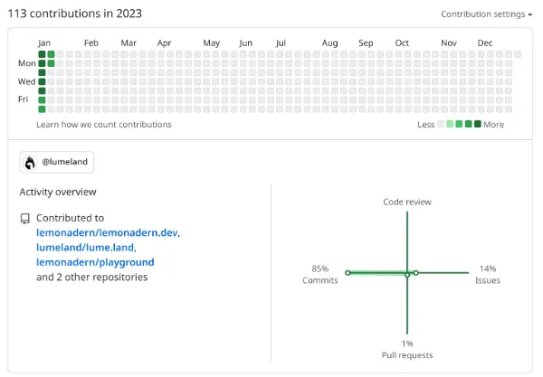

## 今週の日報

- [1/1](/nightly/2023/01/01/)
- [1/2](/nightly/2023/01/02/)
- [1/3](/nightly/2023/01/03/)
- [1/4](/nightly/2023/01/04/)
- [1/5](/nightly/2023/01/05/)
- [1/6](/nightly/2023/01/06/)
- [1/7](/nightly/2023/01/07/)

## やったこと

- 日報の作成・改善（毎日）
- lume のキャッチアップ・コードリーディング（数日）
- 正規表現の勉強 （3日）
- Frontend catchup に参加（1日）
- OAuth2.0 の勉強（1日）

## 今週の成果

- このサイト
  - https://lemonadern.dev
- 『詳説 正規表現 第2版』 3~4章
  - https://zenn.dev/lemonadern/scraps/8d2cec4b08cc36
- PR
  - https://github.com/lumeland/lume.land/pull/53

lume のドキュメントを修正するPRを投げた。もっとかっこいいPRを投げたいです。

## Contribution Graph

日報を毎日いじっていたので結構濃く草が生えている。^[画像サイズ削りすぎてガビガビになってておもしろい]

## 感想

こうやって書き出すと思ったより何もしていなくて唖然としてしまう。
漠然と冬休みにやろうと思っていたOAuthの認可サーバ実装も終わっていないし、正規表現の本はまだ途中までしか読んでいない。コンパイラの本もまだ途中までしか読んでいない。
ままならぬ...

でもこういう気持ちになれるのが大事。振り返ってる意味がある。
それに日報が1周間続いたことは褒めていい。えらい！:tada:

週報に関してはスタイルがまだ定まっていないので探り探りのフォーマットにはなると思う。土曜か日曜にその週7日分を振り返る感じで行こうかな。
本当なら、[こうやって](https://maguro.dev/weekly-report-2021-09-27/)
PRしか存在しない週報を書きたい。投げたPRだけ貼ってあるのかっこよすぎない？
