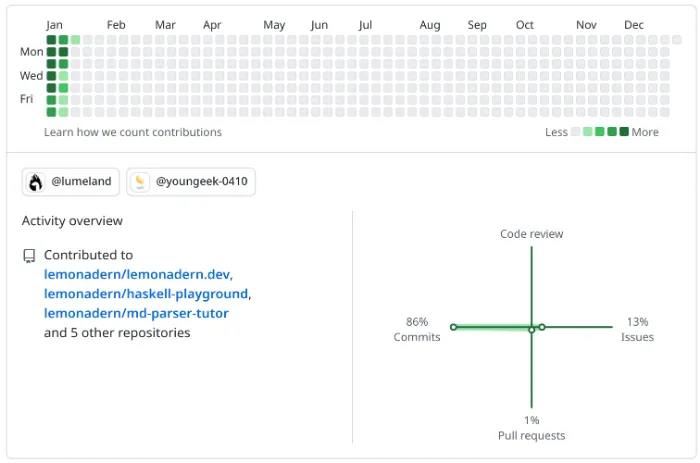

## 今週の日報

- [1/8](/nightly/2023/01/08/)
- [1/9](/nightly/2023/01/09/)
- [1/10](/nightly/2023/01/10/)
- [1/11](/nightly/2023/01/11/)
- [1/12](/nightly/2023/01/12/)
- [1/13](/nightly/2023/01/13/)
- [1/14](/nightly/2023/01/14/)

## やったこと

- OAuth 2.0 の勉強（１日）
- Frontend Catchup に参加（１日）
- マークダウンパーサの写経・コードリーディング（２日）
- 日報の改善（２日）
  - 日報が汎用化
  - lemonadern.dev の運用開始

- その他
  - Haskell 環境構築
  - コンアキ課題

  - 遊び・新年会・単なる怠惰など

## 読書

- 読了
  - 『コンパイラの理論と実現』
  - 中村文則『惑いの森』
  - 中村文則『掏摸』

- 部分的に読んだ、あるいは途中まで
  - 『詳説 正規表現 第2版』 4.6・4.7節
  - プロ言の教科書（ラムダ計算）

## 今週の成果

本をたくさん読んでて偉い。
ちゃんとコードを書いていないので目立った成果はなし。無念。

## Contribution Graph

## 感想

この週報を書いているということは日報が２週間続いているということで、とてもえらい。

今週はたくさん本を読んだけど、コードはあまり書いていない。がんばってほしい。
