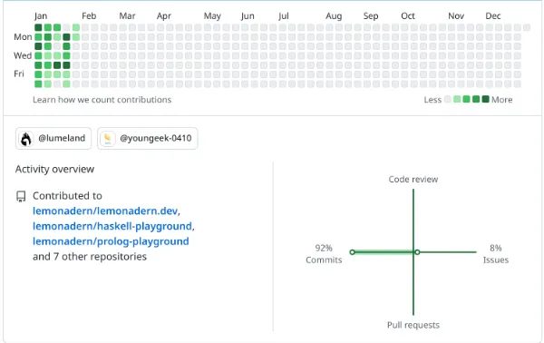

## 今週の日報

- [1/22](/nightly/2023/01/22/)
- [1/23](/nightly/2023/01/23/)
- [1/24](/nightly/2023/01/24/)
- [1/25](/nightly/2023/01/25/)
- [1/26](/nightly/2023/01/26/)
- [1/27](/nightly/2023/01/27/)
- [1/28](/nightly/2023/01/28/)

## やったこと

- Learn You a Haskell for Great Good! 1~6章
  - 3: Types and Typeclasses
  - 4: Syntax in Functions
  - 5: Recursion
  - 6: Higher Order Functions
- Prolog に入門
- Frontend Catchup に参加
- NN-PTJ 3h
- 読書
  - 『銃』を読んだ
  - 『旅のラゴス』を読んだ
  - 『圏論の道案内』を読み始めた（途中）
- 課題
  - 情報通信工学課題(13)
  - 経済の期末課題
  - 小論文課題（構想のみ）

## 今週の成果

Haskell を書き始め、初心者になった。

## 読書

中村文則と筒井康隆を読んだ。

- 銃 ([1/25](/nightly/2023/01/25/))
- 旅のラゴス ([1/26](/nightly/2023/01/26/))

## Contribution Graph

ほとんどが日報コミットと、LYAHFGGで書いていたコードのコミット。

## 感想

Haskell 楽しい！最高！Haskellしかやってない人になってるけどまあいいか。

信じられないことにもう1月が終わるので、月報を書かないといけない。
